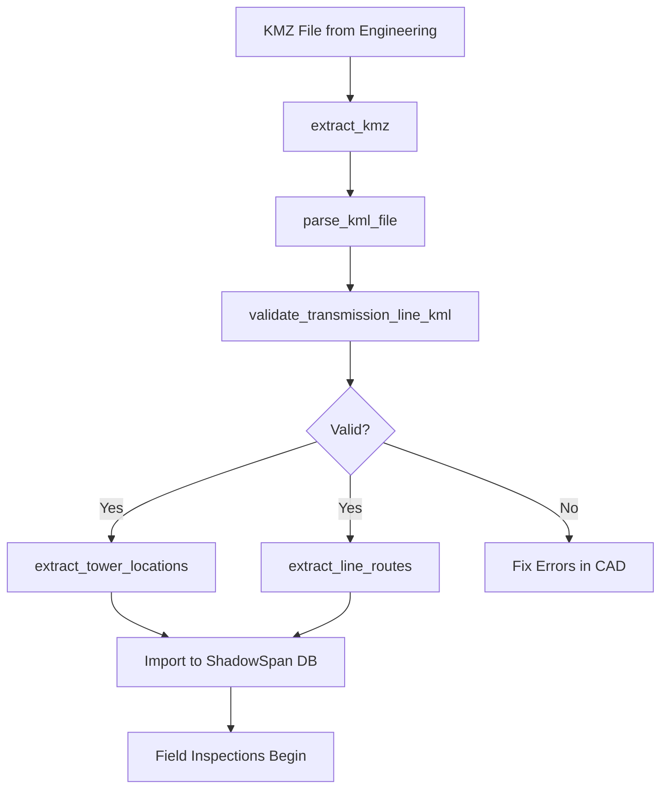

# KML/KMZ Integration Tools

Specialized tools for importing, parsing, and validating KML/KMZ files containing transmission line routes, tower locations, and infrastructure data from engineering design software.

## Overview

These tools enable seamless integration with engineering design workflows:

- **KML Parsing** - Extract features from Google Earth exports
- **KMZ Extraction** - Unpack compressed KML archives
- **Validation** - Verify data integrity for transmission line projects
- **Format Conversion** - Convert to GeoJSON for web applications
- **Feature Extraction** - Isolate specific feature types (towers, routes)

## Supported Software

Tested with exports from:
- Google Earth Pro
- ArcGIS
- QGIS
- PLS-CADD (transmission line design)
- AutoCAD Civil 3D
- Bentley MicroStation

## Available Tools

### 1. Parse KML File

Extract geographic features from KML content.

**Tool Name:** `parse_kml_file`

**Parameters:**
- `kml_content` (string): KML file content as string
- `extract_styles` (boolean, optional): Whether to extract style information (default: true)
- `include_metadata` (boolean, optional): Whether to include extended data and descriptions (default: true)

**Returns:**
- `success`: Boolean indicating parse success
- `features`: List of extracted features with geometries
- `feature_count`: Total number of features
- `geometry_types`: Summary of geometry types found
- `styles`: Style definitions if extract_styles=true
- `metadata`: Document-level metadata

**Supported Geometries:**
- Point (tower locations, equipment)
- LineString (transmission routes, access roads)
- Polygon (substations, ROW boundaries)

**Example:**
```json
{
  "kml_content": "<?xml version=\"1.0\" encoding=\"UTF-8\"?>\\n<kml xmlns=\"http://www.opengis.net/kml/2.2\">...</kml>",
  "extract_styles": true,
  "include_metadata": true
}
```

**Response:**
```json
{
  "success": true,
  "features": [
    {
      "name": "Tower 1",
      "description": "220kV suspension tower",
      "geometry_type": "Point",
      "geometry_wkt": "POINT(-122.084 37.422)",
      "coordinates": [-122.084, 37.422, 125.5],
      "extended_data": {
        "tower_type": "Suspension",
        "height_m": "42",
        "voltage_kv": "220"
      }
    }
  ],
  "feature_count": 45,
  "geometry_types": {
    "Point": 20,
    "LineString": 3,
    "Polygon": 2
  },
  "metadata": {
    "name": "Project Phoenix - Segment A",
    "description": "69kV transmission line upgrade"
  }
}
```

---

### 2. Extract KMZ Archive

Unpack KMZ (compressed KML) files and extract main KML content.

**Tool Name:** `extract_kmz`

**Parameters:**
- `kmz_path` (string): Path to KMZ file
- `output_dir` (string, optional): Directory for extraction (uses temp dir if not specified)

**Returns:**
- `success`: Boolean indicating extraction success
- `kml_content`: Main KML file content as string
- `kml_filename`: Name of main KML file
- `extracted_files`: List of all extracted files
- `extraction_path`: Path to extracted directory
- `kml_file_count`: Number of KML files found

**Example:**
```json
{
  "kmz_path": "/storage/transmission_line_design.kmz"
}
```

**Response:**
```json
{
  "success": true,
  "kml_content": "<?xml version=\"1.0\"...>",
  "kml_filename": "doc.kml",
  "extracted_files": [
    "doc.kml",
    "images/tower_icon.png",
    "images/line_pattern.png"
  ],
  "extraction_path": "/tmp/kmz_extract_abc123/",
  "kml_file_count": 1
}
```

**Notes:**
- KMZ files are ZIP archives containing KML and supporting files
- Tool automatically finds main KML file (typically `doc.kml`)
- Images and icons are preserved for style references

---

### 3. Validate Transmission Line KML

Verify KML contains required elements for transmission line operations.

**Tool Name:** `validate_transmission_line_kml`

**Parameters:**
- `kml_content` (string): KML file content as string
- `require_line_routes` (boolean, optional): Whether LineString geometries are required (default: true)
- `require_tower_points` (boolean, optional): Whether Point geometries are required (default: true)

**Returns:**
- `valid`: Boolean indicating if validation passed
- `validation_errors`: List of validation error messages
- `validation_warnings`: List of non-critical warnings
- `feature_summary`: Summary of found features

**Validation Checks:**
1. **Required Geometries**: LineStrings for routes, Points for towers
2. **Coordinate Validity**: Longitude [-180, 180], Latitude [-90, 90]
3. **Elevation Data**: Checks for z-coordinates
4. **Feature Names**: Verifies placemark names exist
5. **Data Completeness**: Checks for empty coordinates

**Example:**
```json
{
  "kml_content": "<?xml version=\"1.0\"...>",
  "require_line_routes": true,
  "require_tower_points": true
}
```

**Response:**
```json
{
  "valid": false,
  "validation_errors": [
    "No LineString features found (required for transmission line routes)"
  ],
  "validation_warnings": [
    "No elevation data found in coordinates (z-values are 0 or missing)",
    "Feature 'Tower 5' has no coordinates"
  ],
  "feature_summary": {
    "total_features": 20,
    "geometry_types": {
      "Point": 20
    },
    "has_elevation_data": false
  },
  "metadata": {
    "name": "Project Phoenix",
    "description": "Initial survey data"
  }
}
```

---

### 4. Convert KML to GeoJSON

Transform KML features into GeoJSON format for web mapping.

**Tool Name:** `convert_kml_to_geojson`

**Parameters:**
- `kml_content` (string): KML file content as string
- `include_styles` (boolean, optional): Whether to include style info in properties (default: false)

**Returns:**
- `conversion_success`: Boolean success indicator
- `geojson`: GeoJSON FeatureCollection object
- `geojson_string`: Formatted GeoJSON as string
- `feature_count`: Number of features converted

**Example:**
```json
{
  "kml_content": "<?xml version=\"1.0\"...>",
  "include_styles": false
}
```

**Response:**
```json
{
  "conversion_success": true,
  "geojson": {
    "type": "FeatureCollection",
    "features": [
      {
        "type": "Feature",
        "geometry": {
          "type": "Point",
          "coordinates": [-122.084, 37.422]
        },
        "properties": {
          "name": "Tower 1",
          "description": "220kV suspension tower",
          "tower_type": "Suspension",
          "height_m": "42"
        }
      }
    ]
  },
  "feature_count": 20
}
```

**Use Cases:**
- Import to Leaflet/Mapbox web maps
- Load into ShadowSpan mobile PWA
- Process with JavaScript GIS libraries
- Store in GeoJSON-compatible databases

---

### 5. Extract Tower Locations

Filter and extract Point features representing transmission towers.

**Tool Name:** `extract_tower_locations`

**Parameters:**
- `kml_content` (string): KML file content as string
- `name_pattern` (string, optional): Regex pattern to filter by name (e.g., "Tower.*")

**Returns:**
- `success`: Boolean indicating success
- `towers`: List of tower features with coordinates
- `tower_count`: Total number of towers found
- `bounding_box`: Geographic extent of all towers
- `name_filter_applied`: Whether name filter was used

**Example:**
```json
{
  "kml_content": "<?xml version=\"1.0\"...>",
  "name_pattern": "Tower.*"
}
```

**Response:**
```json
{
  "success": true,
  "towers": [
    {
      "name": "Tower 1",
      "coordinates": [-122.084, 37.422, 125.5],
      "longitude": -122.084,
      "latitude": 37.422,
      "elevation": 125.5,
      "description": "220kV suspension tower",
      "extended_data": {
        "tower_type": "Suspension",
        "height_m": "42"
      }
    }
  ],
  "tower_count": 23,
  "bounding_box": {
    "min_lon": -122.095,
    "max_lon": -122.070,
    "min_lat": 37.415,
    "max_lat": 37.430
  },
  "name_filter_applied": true
}
```

**Name Patterns:**
- `"Tower.*"` - Matches "Tower 1", "Tower 2", etc.
- `".*-[0-9]+"` - Matches "A-1", "B-2", etc.
- `"Structure.*"` - Matches "Structure 001", etc.
- `"^T[0-9]{3}$"` - Matches "T001", "T002", etc. (exactly 3 digits)

---

### 6. Extract Line Routes

Filter and extract LineString features representing transmission lines.

**Tool Name:** `extract_line_routes`

**Parameters:**
- `kml_content` (string): KML file content as string
- `name_pattern` (string, optional): Regex pattern to filter by name

**Returns:**
- `success`: Boolean indicating success
- `routes`: List of route features with coordinates
- `route_count`: Total number of routes found
- `total_length_degrees`: Estimated total route length (degrees)
- `name_filter_applied`: Whether name filter was used

**Example:**
```json
{
  "kml_content": "<?xml version=\"1.0\"...>",
  "name_pattern": ".*Line.*"
}
```

**Response:**
```json
{
  "success": true,
  "routes": [
    {
      "name": "Transmission Line - Segment A",
      "coordinates": [
        [-122.084, 37.422, 125],
        [-122.083, 37.423, 128],
        [-122.082, 37.424, 130]
      ],
      "geometry_wkt": "LINESTRING(-122.084 37.422 125, -122.083 37.423 128, ...)",
      "length_degrees": 0.002828,
      "vertex_count": 3,
      "description": "69kV line segment",
      "extended_data": {
        "voltage_kv": "69",
        "conductor_type": "ACSR_336"
      }
    }
  ],
  "route_count": 3,
  "total_length_degrees": 0.008484,
  "name_filter_applied": true
}
```

---

## Workflow Examples

### Complete Import Workflow



### ShadowSpan Integration

**Step 1: Import Engineering Design**
```python
# Extract KMZ
result = extract_kmz("/uploads/project_phoenix.kmz")
kml_content = result["kml_content"]

# Validate
validation = validate_transmission_line_kml(kml_content)
if not validation["valid"]:
    print(f"Errors: {validation['validation_errors']}")
    exit(1)

# Extract features
towers = extract_tower_locations(kml_content, "Tower.*")
routes = extract_line_routes(kml_content, ".*Segment.*")
```

**Step 2: Store in ShadowSpan Database**
```rust
// In Tauri backend (Rust)
for tower in towers.towers {
    db.create_asset(Asset {
        name: tower.name,
        asset_type: AssetType::Tower,
        latitude: tower.latitude,
        longitude: tower.longitude,
        elevation: tower.elevation,
        metadata: tower.extended_data,
    })?;
}
```

**Step 3: Sync to Mobile PWA**
```typescript
// Mobile app (React)
const syncData = await fetch('http://localhost:8081/api/sync/pull');
const { assets, routes } = await syncData.json();

// Store in IndexedDB for offline access
await db.assets.bulkPut(assets);
```

---

## Data Quality Best Practices

### Pre-Import Checks
1. **Verify Coordinate System**: Ensure KML uses WGS84 (EPSG:4326)
2. **Include Elevations**: Always export with z-coordinates from engineering software
3. **Consistent Naming**: Use consistent naming conventions (e.g., "Tower 001", not "Tower 1")
4. **Extended Data**: Include all relevant attributes (voltage, conductor type, structure type)
5. **Test Sample**: Import a small segment first to verify data quality

### Common Issues

| Issue | Cause | Solution |
|-------|-------|----------|
| Missing elevations | 2D export from CAD | Re-export as 3D KML with terrain |
| Invalid coordinates | Wrong coordinate system | Reproject to WGS84 |
| No features found | Wrong KML structure | Use Placemark elements |
| Parsing errors | Invalid XML | Validate XML syntax |
| Missing extended data | Export settings | Enable "Extended Data" in export |

### Engineering Software Export Settings

**Google Earth Pro:**
- File → Save → Save Place As... → KML/KMZ
- Check "Absolute" altitudes
- Include descriptions and extended data

**ArcGIS:**
- Toolbox → Conversion Tools → To KML
- Enable "Export Extended Attributes"
- Use "Absolute Height" mode

**QGIS:**
- Right-click layer → Export → Save Features As → KML
- Select "Include Z dimension"
- Enable "Export attributes"

**PLS-CADD:**
- File → Export → Google Earth (KML)
- Select all structure layers
- Include conductor paths
- Export extended properties

---

## API Response Examples

### Successful Parse with All Features
```json
{
  "success": true,
  "features": [
    {
      "name": "Tower 1",
      "description": "69kV suspension tower",
      "geometry_type": "Point",
      "geometry_wkt": "POINT(-122.084 37.422)",
      "coordinates": [-122.084, 37.422, 125.5],
      "extended_data": {
        "structure_type": "Suspension",
        "height_m": "42",
        "foundation": "Concrete pier",
        "installation_date": "2023-05-15"
      }
    },
    {
      "name": "Segment A",
      "description": "Main transmission line",
      "geometry_type": "LineString",
      "geometry_wkt": "LINESTRING(-122.084 37.422, -122.083 37.423, -122.082 37.424)",
      "coordinates": [
        [-122.084, 37.422, 125],
        [-122.083, 37.423, 128],
        [-122.082, 37.424, 130]
      ],
      "extended_data": {
        "voltage_kv": "69",
        "conductor": "ACSR 336.4 MCM",
        "phases": "3"
      }
    }
  ],
  "feature_count": 25,
  "geometry_types": {
    "Point": 20,
    "LineString": 3,
    "Polygon": 2
  },
  "styles": {
    "tower_style": {
      "icon": {
        "href": "images/tower_icon.png",
        "scale": 1.2
      }
    },
    "line_style": {
      "line": {
        "color": "ff0000ff",
        "width": 3.0
      }
    }
  },
  "metadata": {
    "name": "Project Phoenix - Phase 1",
    "description": "69kV transmission line upgrade, Segments A-C"
  }
}
```

### Validation Failure
```json
{
  "valid": false,
  "validation_errors": [
    "No LineString features found (required for transmission line routes)",
    "Invalid coordinate in feature 'Tower 5': [250.0, 95.0, 100]"
  ],
  "validation_warnings": [
    "No elevation data found in coordinates (z-values are 0 or missing)",
    "Feature 'Access Road' has no description"
  ],
  "feature_summary": {
    "total_features": 15,
    "geometry_types": {
      "Point": 15
    },
    "has_elevation_data": false
  }
}
```

---

## Performance Considerations

### File Size Limits
- **Recommended**: < 5 MB per KML/KMZ file
- **Maximum**: 50 MB (adjust server settings if needed)
- **Large Projects**: Split into multiple files by segment

### Parse Times
- **Small** (< 100 features): < 50ms
- **Medium** (100-1000 features): 50-200ms
- **Large** (1000-5000 features): 200ms-1s
- **Very Large** (> 5000 features): Consider splitting file

### Memory Usage
- **KMZ Extraction**: Temporary disk space = 2-3x file size
- **Parse Operation**: RAM usage ≈ 10x file size (for XML parsing)
- **GeoJSON Conversion**: RAM usage ≈ 5x file size

---

## Related Documentation

- [Transmission Line Tools](./transmission-line-tools.md) - Engineering calculations
- [ShadowSpan Import Guide](../../apps/desktop/docs/import-guide.md) - Desktop app import workflow
- [Mobile Sync Protocol](../../apps/mobile/docs/sync.md) - Field data synchronization

---

## Support

For issues or questions:
- **GitHub Issues**: [volt-sage/issues](https://github.com/your-org/volt-sage/issues)
- **GIS MCP Documentation**: [gis-mcp.com/docs](https://gis-mcp.com/docs)
- **Engineering Support**: engineering@yourcompany.com
